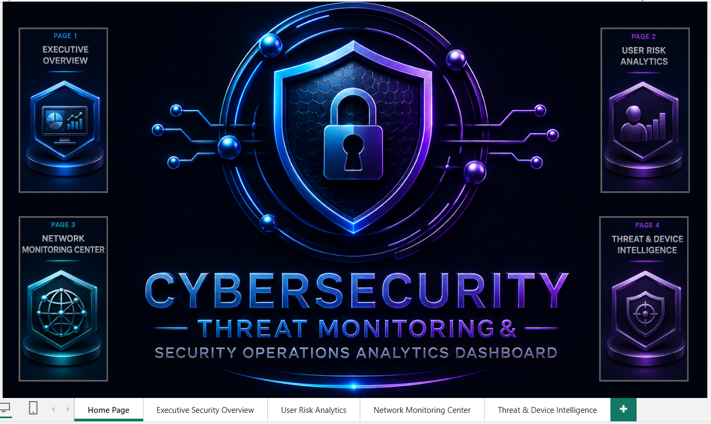

# 🔐 Cybersecurity Threat Monitoring & Security Operations Analytics Dashboard

A complete end-to-end Cybersecurity Analytics project focused on security event monitoring, threat intelligence, user risk analytics, network activity monitoring, and executive security reporting.

Built using:

# Azure SQL Database → SQL Views → Power BI → DAX Modeling

---

# 🔗 Live Dashboard

[View Dashboard](https://app.fabric.microsoft.com/links/eOVfaiK_Nw?ctid=608e2447-f9f0-4489-8567-8524bcb2ec44&pbi_source=linkShare)

---

---

# 📌 Project Overview

This project is a complete Cybersecurity Threat Monitoring & Security Operations Analytics solution designed to analyze:

- Security Events
- User Risk Exposure
- Threat Intelligence
- Network Activity
- Device Intelligence
- Authentication Failures
- Security Operations Performance

The goal of this project was to build an enterprise-style cybersecurity monitoring platform using Azure SQL and Power BI.

---

# 🏗️ Azure SQL Data Engineering Workflow

## Step 1 — Raw Data Ingestion

Raw cybersecurity data was loaded into Azure SQL Database.

The dataset contains:

- User Information
- Device Information
- Threat Records
- Security Events
- Network Activity Logs

---

## Step 2 — Data Warehouse Design

### Dimension Tables

- dim_users
- dim_devices
- dim_threats

### Fact Tables

- fact_security_events
- fact_network_activity

---

## Step 3 — SQL Data Cleaning

Reusable SQL Views were created for cleaning and standardization.

### Views Created

- vw_users_clean
- vw_devices_clean
- vw_threats_clean
- vw_security_events_clean
- vw_network_activity_clean

### Cleaning Logic

- Duplicate Removal
- Missing Value Handling
- Threat Standardization
- User Data Cleaning
- Device Data Cleaning
- Invalid Network Values Correction
- Security Event Standardization

---

## Step 4 — Analytics Layer

### Security Analytics View

vw_security_analytics

Features:

- Risk Scoring
- Risk Classification
- Failed Login Detection
- Locked Account Tracking
- User Security Monitoring
- Time Intelligence Columns

Created Columns:

- event_date
- event_year
- event_quarter
- event_month_no
- event_month_name
- weekday_name

---

### Network Analytics View

vw_network_summary

Features:

- Total Connections
- Average Failed Attempts
- Maximum Failed Attempts
- Minimum Failed Attempts
- Country-Level Monitoring
- Network Traffic Analysis

---

## Step 5 — Azure SQL Final Architecture

### Cleaning Views

- vw_users_clean
- vw_devices_clean
- vw_threats_clean
- vw_security_events_clean
- vw_network_activity_clean

### Analytics Views

- vw_security_analytics
- vw_network_summary

**Total Views Created: 7**

---

# 🛠️ Tools & Technologies

| Tool | Purpose |
|--------|----------|
| Azure SQL Database | Data Storage & Processing |
| SQL | Data Cleaning & Analytics |
| SQL Views | Transformation Layer |
| Power BI | Dashboard Development |
| DAX | KPI & Analytics Calculations |
| Data Modeling | Relationship Modeling |

---

# 📊 Dashboard Pages

---

# 🏠 Home Page

Project Navigation Hub

Provides quick navigation to all dashboard sections.

---

# 🟦 Page 1 — Executive Security Overview

Focus Areas:

- Security Events
- Failed Logins
- Locked Accounts
- Risk Monitoring
- Security Trends

Visuals:

- KPI Cards
- Monthly Security Event Trend
- Risk Category Distribution
- Security Events by Location
- Weekday Activity Heatmap
- Key Findings

---

# 🟪 Page 2 — User Risk Analytics

Focus Areas:

- User Monitoring
- Failed Events
- Risk Exposure
- Geographic Analysis

Visuals:

- KPI Cards
- User Distribution by Location
- Location vs Failed Events
- Location Risk Score vs Failed Events
- Location Risk Summary
- Key Findings

---

# 🟦 Page 3 — Network Monitoring Center

Focus Areas:

- Network Traffic
- Connection Monitoring
- Protocol Analysis
- Failed Attempts
- IP Intelligence

Visuals:

- KPI Cards
- Connection Status Distribution
- Protocol Traffic Distribution
- Top 10 IP Addresses
- Avg Failed Attempts by Protocol
- Top Port Distribution
- Key Findings

---

# 🟪 Page 4 — Threat & Device Intelligence

Focus Areas:

- Threat Monitoring
- Threat Severity
- Threat Status
- Device Intelligence
- Operating System Analysis

Visuals:

- KPI Cards
- Threat Type Distribution
- Threat Severity Distribution
- Operating System Distribution
- Device Type Distribution
- Device Type vs Operating System
- Key Findings

---

# 📸 Dashboard Preview

## Home Page

---

## Executive Security Overview

---

## User Risk Analytics

---

## Network Monitoring Center

---

## Threat & Device Intelligence

---

# 🧠 Skills Demonstrated

- Azure SQL Database
- SQL Data Cleaning
- SQL Views
- Data Warehousing
- Data Modeling
- Power BI
- DAX
- Cybersecurity Analytics
- Network Monitoring
- Threat Intelligence
- Executive Reporting
- Dashboard Design

---

# ✅ Project Outcome

This project demonstrates an enterprise-grade Cybersecurity Analytics Platform capable of:

- Monitoring Security Events
- Tracking User Risk Exposure
- Analyzing Threat Intelligence
- Monitoring Network Activity
- Evaluating Device Security
- Supporting Security Operations Decision-Making
- Delivering Executive-Level Security Insights

---

# 👨‍💻 About Me

## Sayan Naha

📧 Email: snsayan2012@gmail.com

🔗 LinkedIn: https://www.linkedin.com/in/sayan-naha/
